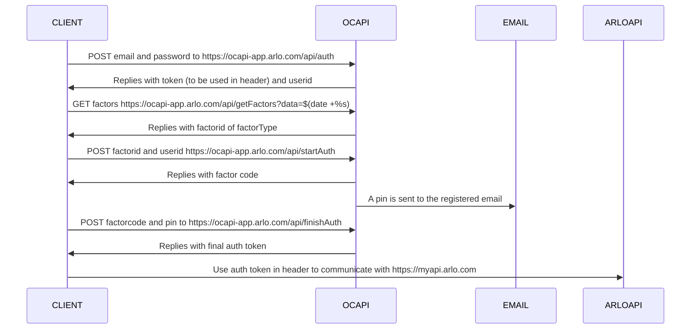

# Bash api integration for arlo

Purpose of this project is to enable communication with ARLO cameras and the ARLO cloud through bash scripts
A process for handling the ARLO MFA is automated based on email.

State of the project:

- [x] MFA automation
- [x] Basic communication with ARLO
- [x] Get devices
- [x] Arm/Disarm device
- [ ] Map more API functionality

## Requirements

`expect`
`jq`
`openssl`

## Usage

To reliably refresh the session tokens every 14 days, I recomend creating a free outlook email and granting that email access under "Settings->Grant Access" on https://my.arlo.com. 
Make sure to activate the new user, login and enable email MFA.

Create a file called `arlo.conf` in the same directory as the `arlo.sh` script.
The content of `arlo.conf` should be:
```
ARLO_USER="email@example.com"
ARLO_PWD="password"
IMAP_USER="email@example.com"
IMAP_PWD="password"
IMAP_HOST="imap.example.com"
```

Example interaction:
```
./arlo_devices.sh
./arlo_arm.sh [DEVICEID]
./arlo_disarm.sh [DEVICEID]
```

Once logged in the session is stored in the session.txt until it automatically renews upon expiry.


## Mimic geofencing arming/disarming

If you are not comfortable with ARLO always knowing your location on you mobile device, this is an excellent alternative. By monitoring your home network for you mac addresses, this script can arm/disarm a camera

```
./monitor.sh "./arlo_disarm.sh DEVICEID" "./arlo_arm.sh DEVICEID" MACADDRESS [MACADDRESS]
```

## login process with 2FA

Arlo requires 2Factor authentication for logins. Below is a diagram of the process

